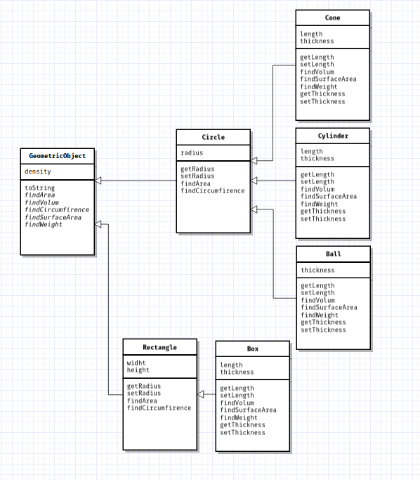

# Oblig4

## Description
A simple Geometric calculation framework developed by Odin Hultgren Van Der Horst and Petter Berven as a groupassigment at HSN.

## makefile options
To build and run the gui application
```
make run_gui 
```
To build and run the oblig4 applcation
```
make run_oblig
```
To build all files
```
make
```

To clean directory
```
make clean
```


## UML Drawing

